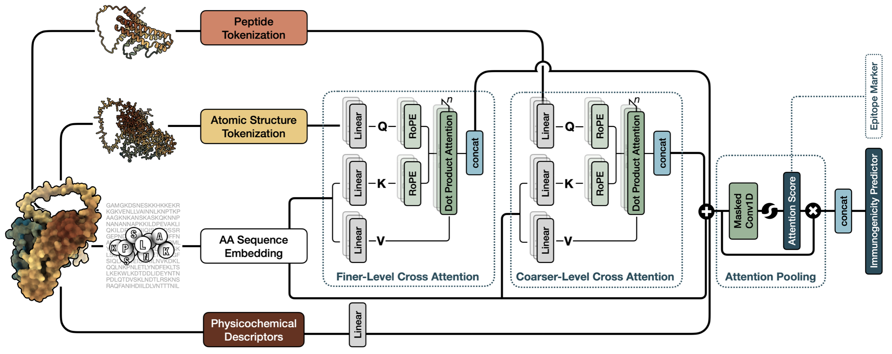

# VenusVaccine

<div align="center">

[]

[](https://www.python.org/)
[](https://pytorch.org/)
[](https://www.gnu.org/licenses/gpl-3.0)

</div>

## 📋 Overview

VenusVaccine is a deep learning-based immunogenicity prediction tool focused on the classification of protective antigen or non-protective antigen. The project leverages advanced pre-trained language models and adapter architectures to interpret immunogenicity based on the multimodal encoding of antigens, including their sequences, structures, and physico-chemical properties.

<div align="center">
  
</div>

### 🌟 Key Features

- 🔬 **Versatile Data Processing**
  - Support for multiple protein database formats
  - Efficient data preprocessing and feature extraction
  - Flexible data augmentation strategies

- 🧬 **Protein Feature Extraction**
  - E-descriptor and Z-descriptor physicochemical features
  - Foldseek secondary structure prediction
  - ESM3 structure sequence encoding

- 🤖 **Advanced Model Architecture**
  - Integration with pre-trained protein language models
  - Innovative adapter design
  - Support for multiple PLM types (ESM, Bert, AnKh etc.)

- 📊 **Comprehensive Training Framework**
  - Cross-validation support
  - Early stopping strategy
  - Wandb experiment tracking
  - Automated model evaluation

- 🚀 **High-Performance Computing**
  - GPU acceleration support
  - Distributed training
  - Gradient accumulation optimization

## 🛠️ Installation Guide

### Requirements

- Python 3.7+
- CUDA 11.0+ (for GPU training)
- 8GB+ RAM

### Setup Steps

1. Clone the repository:
```bash
git clone https://github.com/songleee/VenusVaccine.git
cd VenusVaccine
```

2. Create a virtual environment:
```bash
conda env create -f environment.yaml
```

3. Download data and checkpoints:
Download the pre-trained model files, training data, and model evaluation results from [Google Drive](https://drive.google.com/drive/folders/1VLEGpFv7jFyWGChzxchxv-D99QUBlqOA?usp=sharing)

Pre-trained model files should be placed in the `ckpt` directory:
- `ckpt/Bacteria.pt`: Model for bacterial protective antigens
- `ckpt/Virus.pt`: Model for viral protective antigens
- `ckpt/Tumor.pt`: Model for tumor protective antigens

4. Download and install dependencies:
- [Foldseek](https://github.com/steineggerlab/foldseek/releases/tag/10-941cd33)
- [ESM3_encoder](https://huggingface.co/EvolutionaryScale/esm3-sm-open-v1/blob/main/data/weights/esm3_structure_encoder_v0.pth)
```bash
wget https://huggingface.co/EvolutionaryScale/esm3-sm-open-v1/blob/main/data/weights/esm3_structure_encoder_v0.pth
mkdir -p ./src/data/weights
mv esm3_structure_encoder_v0.pth ./src/data/weights
```

## 📊 Data Processing

### Predict single protein sequence

```bash
# Predict single protein sequence
python src/esmfold.py --sequence "MKTVRQERLKSIVRILERSKEPVSGAQLAEELSVSRQVIVQDIAYLRSLGYNIVATPRGYVLAGG" --out_file output.pdb

# Predict multiple proteins from FASTA file
python src/esmfold.py --fasta_file proteins.fasta --out_dir pdb_structures --fold_chunk_size 128

```

### PDB to JSON Conversion

Make sure you have got the PDB file (cryo-EM structure or predicted by AF2 or ESMFold) of interest protein first, and use `pdb2json.py` to convert PDB files to a feature-rich JSON format:

```bash
python pdb2json.py <pdb_dir> <output_json_file>
```

This tool automatically extracts:
- Amino acid sequence
- ESM3 structure sequence
- Foldseek secondary structure prediction
- E-descriptor (5-dimensional) features
- Z-descriptor (3-dimensional) features

## 🚀 Quick Start

### Basic Usage

```bash
python infer.py -i input.json -t Bacteria
```

### Command Line Arguments

```bash
python infer.py [-h] -i INPUT -t {Bacteria,Virus,Tumor} [--structure_seqs STRUCTURE_SEQS] 
                [--max_seq_len MAX_SEQ_LEN] [--max_batch_token MAX_BATCH_TOKEN] 
                [--num_workers NUM_WORKERS] [-o OUTPUT]
```

Arguments:
- `-i, --input`: Path to input JSON file (required)
- `-t, --type`: Pathogen type, choose from: Bacteria, Virus, Tumor (required)
- `--structure_seqs`: Types of structure sequences, comma-separated (default: e_descriptor,z_descriptor,foldseek_seq,esm3_structure_seq)
- `--max_seq_len`: Maximum sequence length (default: 1024)
- `--max_batch_token`: Maximum tokens per batch (default: 10000)
- `--num_workers`: Number of data loading workers (default: 4)
- `-o, --output`: Path to output CSV file (default: results_{type}.csv)

### Input Format

The input should be a JSON file with one sample per line. Fields required depend on the specified structure_seqs parameter:

```json
{
    "name": "protein1",
    "aa_seq": "MKTVRQERLKSIVRILERSKEPVSGAQLAEELSVSRQVIVQDIAYLRSLGYNIVATPRGYVLAGG",
    "foldseek_seq": "HHHEEELLCCHHHHHHHHHHHHSTTHHHHHHHHHHHHHHHHHHHHHHHHEETTEEHHHHHH",
    "esm3_structure_seq": [1, 2, 3, ..],
    "e_descriptor": [[0.1, 0.2, 0.3, 0.4, 0.5], ..],
    "z_descriptor": [[0.1, 0.2, 0.3], ..]
}
```

Required fields:
- `name`: Protein sequence identifier
- `aa_seq`: Amino acid sequence

Optional fields (depending on structure_seqs parameter):
- `foldseek_seq`: Secondary structure sequence predicted by Foldseek
- `esm3_structure_seq`: Structure sequence predicted by ESM3
- `e_descriptor`: E-descriptor features (5-dimensional)
- `z_descriptor`: Z-descriptor features (3-dimensional)

### Output Format

The output is a CSV file containing:
- `name`: Protein sequence identifier
- `aa_seq`: Amino acid sequence
- `pred_label`: Prediction label (0: non-protective antigen, 1: protective antigen)
- `pred_proba`: Prediction probability of being a protective antigen

### Examples

1. Predict using all structural features:
```bash
python infer.py -i proteins.json -t Bacteria
```

2. Use only specific structural features:
```bash
python infer.py -i proteins.json -t Virus --structure_seqs "e_descriptor,z_descriptor"
```

3. Specify output file:
```bash
python infer.py -i proteins.json -t Tumor -o predictions.csv
```

4. Adjust sequence length and batch size:
```bash
python infer.py -i proteins.json -t Bacteria --max_seq_len 512 --max_batch_token 5000
```

## ⚠️ Important Notes

1. Ensure all required dependencies are installed
2. Make sure corresponding model files exist in the `ckpt` directory (`Bacteria.pt`, `Virus.pt`, or `Tumor.pt`)
3. Make sure the PLM checkpoints downloaded from huggingface are set up correctly if the network failed
4. GPU is recommended for better inference performance

## 📝 Citation

If you find this tool helpful, please cite our work:
```
@inproceedings{
li2025immunogenicity,
title={Immunogenicity Prediction with Dual Attention Enables Vaccine Target Selection},
author={Song Li and Yang Tan and Song Ke and Liang Hong and Bingxin Zhou},
booktitle={The Thirteenth International Conference on Learning Representations},
year={2025},
url={https://openreview.net/forum?id=hWmwL9gizZ}
}
```

## 📝 License

This project is licensed under the terms of the [CC-BY-NC-ND-4.0](https://creativecommons.org/licenses/by-nc-nd/4.0/legalcode) license.

## 📮 Contact

- Project Maintainer: Song Li, Yang Tan
- Email: songlee@sjtu.edu.cn
- Issue Tracking: [Issue Page](https://github.com/songleee/VenusVaccine/issues)

---

<div align="center">
⭐️ If you find this project helpful, please give it a star!
</div>